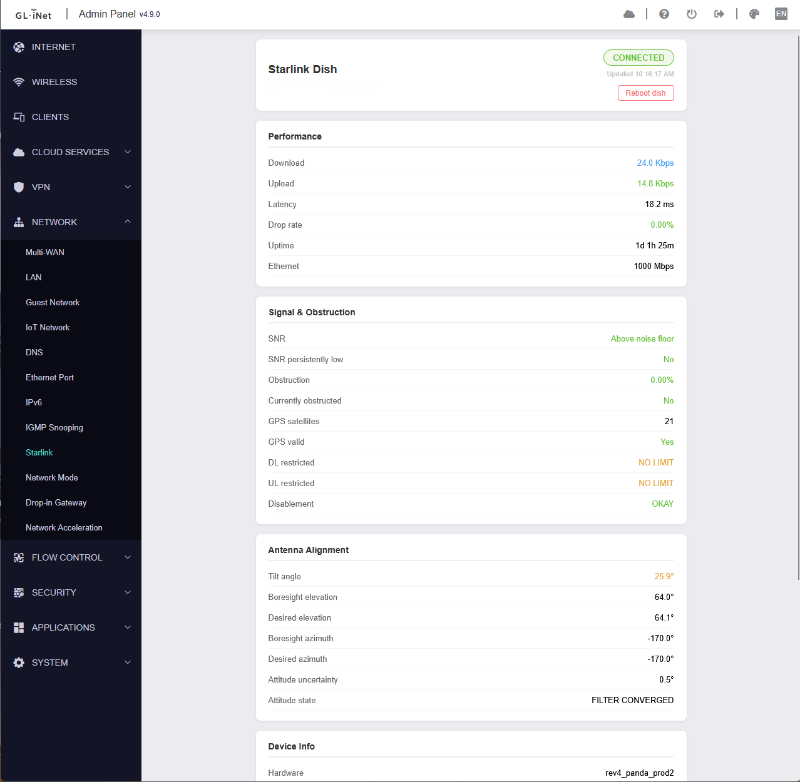

# starlink-panel — GL.iNet 4.x (MT-3000 / Beryl AX)

Starlink dish telemetry dashboard for **GL.iNet 4.x stock firmware** (GL-iNet Beryl AX / MT-3000 and compatible). Adds a **Starlink** entry under the Network tab in the GL.iNet web interface.

Works with Starlink Gen3 and higher dish.



---

## Features

- **Connection status** — CONNECTED / SEARCHING with last-updated timestamp
- **Performance** — download/upload throughput, latency, drop rate, uptime, Ethernet speed
- **Signal & Obstruction** — SNR, SNR persistently low, obstruction %, currently obstructed, GPS satellites, GPS valid, DL/UL restrictions, disablement code
- **Antenna Alignment** — tilt angle, boresight elevation/azimuth, desired elevation/azimuth, attitude uncertainty, attitude state (filter convergence)
- **Device Info** — hardware version, software version, country code, boot count, snow melt mode
- **Recent Outages** — last outages with cause and duration
- **Ready States** — RF, L1/L2, xPHY, SCP, AAP ready flags
- **Reboot Dish** button with confirmation dialog

Auto-refreshes every 10 seconds.

---

## Requirements

| Requirement | Notes |
|-------------|-------|
| Router | GL.iNet Beryl AX (MT-3000) or compatible GL.iNet 4.x device |
| Firmware | GL.iNet 4.x stock firmware (tested on 4.9.0) |
| Architecture | `aarch64` — the `starlink-dish` binary is aarch64; the IPK itself is architecture-independent |
| Package manager | `opkg` (built into GL.iNet firmware) |

---

## Installation

### Step 1 — Download the IPK

Download `luci-app-starlink-panel_*.ipk` from the [latest release](../../releases/latest).

### Step 2 — Install via GL.iNet web interface

1. Open the GL.iNet web interface (http://192.168.1.1)
2. Go to **System → Advanced Settings** to open LuCI
3. In LuCI go to **System → Software**
4. Click **Upload Package...**, select the `.ipk` file, click **Upload**

**Or install via SSH:**
```sh
scp -O luci-app-starlink-panel_*.ipk root@192.168.1.1:/tmp/
ssh root@192.168.1.1 'opkg install --force-depends /tmp/luci-app-starlink-panel_*.ipk'
```

### Step 3 — Navigate to the dashboard

Go to **Network → Starlink** in the GL.iNet web interface.

> The post-install script downloads the `starlink-dish` binary in the background (~1.4 MB). Dish telemetry populates on the next poll once the binary is present. If it doesn't appear, run `/usr/bin/install-grpcurl` manually over SSH.

---

## How it works

The package installs two components:

| Component | Purpose |
|-----------|---------|
| `starlink-dish` binary | Talks to the dish at `192.168.100.1:9200` via gRPC; replaces the ~15 MB `grpcurl` |
| GL.iNet OUI panel | Vue.js view + Lua RPC backend served by the GL.iNet nginx stack |

The Lua backend at `/usr/lib/oui-httpd/rpc/starlink` shells out to `starlink-dish dish`, parses the JSON output, and returns it to the browser. No external dependencies — works fully offline.

---

## Gen3 dish quirk

`disablement_code = 1` (UNKNOWN_REASON) is reported even when fully connected. The panel treats code 1 as **OKAY** when `rs_rf = true`, matching observed Gen3 behaviour.

---

## Build from Source

Requires Docker.

```sh
git clone https://github.com/bigmalloy/gl-mt3000-starlink-panel
cd gl-mt3000-starlink-panel
./build-ipk-docker.sh
# Output: output/luci-app-starlink-panel_1.0.0-22_all.ipk
```

To also cross-compile the `starlink-dish` binary:
```sh
./build-rust-cross.sh
# Output: output/starlink-dish  (aarch64 musl, ~1.4 MB stripped)
```

### Quick iteration (JS/Lua only — no rebuild needed)

```sh
# Push JS view update (gzip on the fly):
gzip -c files/gl-sdk4-ui-starlink.common.js | ssh root@192.168.1.1 'cat > /www/views/gl-sdk4-ui-starlink.common.js.gz'

# Push Lua RPC backend update:
scp -O files/oui-rpc-starlink.lua root@192.168.1.1:/usr/lib/oui-httpd/rpc/starlink
```

---

## Hardware Tested

| Field | Value |
|-------|-------|
| Device | GL-iNet Beryl AX (MT-3000) |
| SoC | MediaTek MT7981B (aarch64) |
| Firmware | GL.iNet 4.9.0 (OpenWrt 21.02-SNAPSHOT) |
| Starlink | Gen3 dish (rev4_panda_prod2) |
| ISP | Starlink Residential (AU) |

---

## Related

- [starlink-panel](https://github.com/bigmalloy/starlink-panel) — the OpenWrt 25.x variant of this package (APK, LuCI Advanced)

---

## Buy me a beer

If this saved you some time, feel free to shout me a beer!

[](https://paypal.me/bergfirmware)

---

## License

MIT
